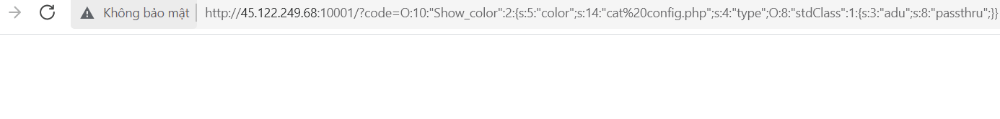

# Insecure Deserialization Challenge

***Description***

- Challenge cho chúng ta một trang web có giao diện như trên và yêu cầu chúng ta tìm ra flag được ẩn trên trang web đó.

***Background***

- Đây là một challenge về Insecure Deserialization nên bạn cần phải có các kiến thức căn bản về Insecure Deserialization và đặc biệt trong trường hợp này là [PHP Insecure Deserialization](https://portswigger.net/web-security/deserialization/exploiting).

***Writeup***

- Đầu tiên, ta thấy rằng chương trình đã cho chúng ta một chuỗi mã để chúng ta có thể dễ dàng khai thác lỗ hổng Insecure Deserialization bằng cách thêm vào url đoạn mã sau: `\?code=<chuỗi serialization>`

- Tiếp theo, ta thấy rằng chương trình cho chúng ta ba class có thể khai thác được. Tuy nhiên, cả ba class đều không có thông tin về flag nhưng ở class thứ hai lại có hàm `__destruct()` và hàm này có chứa một hàm khác là `call_user_func()` mà chúng ta có thể khai thác được.

> **Note:** `call_user_func($function_name,$args)` được sử dụng để gọi các hàm được cung cấp tên bằng tham số đầu tiên `$function_name` và các đối số sẽ được truyền vào hàm đó thông qua tham số thứ hai `$args`. `call_user_func()` thường được dùng để gọi các hàm do người dùng định nghĩa nhưng chúng ta vẫn có thể sử dụng nó để gọi có sẵn như `passthru` hay `exec`.

- Tuy nhiên, chúng ta còn một vấn đề cần giải quyết đó chính là đối số đầu tiên nhập vào hàm `call_user_func()` lại chứa hai toán tử mũi tên nên thuộc tính `type` mà chúng ta cần giờ sẽ không còn là một chuỗi nữa mà phải là một object có chứa thuộc tính `adu` có giá trị bằng `passthru` và chúng ta cần object đó có thể hiểu được bởi mục tiêu đang khai thác.

- May mắn cho chúng ta rằng là chúng ta có thể tạo được object như vậy với [stdObject trong PHP](https://www.php.net/manual/en/language.types.object.php)

- Từ đây, ta sẽ bắt đầu tạo một script có khả năng tạo ra một chuỗi serialization và chuỗi này có khả năng liệt kê các file, folder và các quyền đối với chúng trong folder hiện tại.

*script:*

*kết quả chạy script:*

- Sử dụng chuỗi serialization trên ta thu được thêm một file `config.php` và ta có quyền để đọc nó:

- Tiếp tục sửa đổi trực tiếp chuỗi serialization trên hoặc sửa đổi script để thu được một chuỗi serialization dùng để đọc file `config.php`.

- Tuy nhiên, lần này ta chỉ thu được một trang web trống. Ta tiếp tục thử đọc file `index.php` thì lại thu được kết quả nhưng kết quả này lại không đầy đủ so với thông tin mà ta thấy trước đó của trang web => trong lúc render trang web thì một số thông tin đã bị ẩn đi.

- Ta thử lại việc đọc file `config.php` và sử dụng tiếp tính năng `inspect element` của browse để lấy hoàn toàn kết quả trả về thì ta thu được kết quả như sau:

> Flag thu được là: `flag{n0j_l0j_pk4j_qju_l4y_l0j_dunq_nku_c0n_bu0m_d4u_r0j_l4j_b4y}`